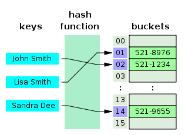
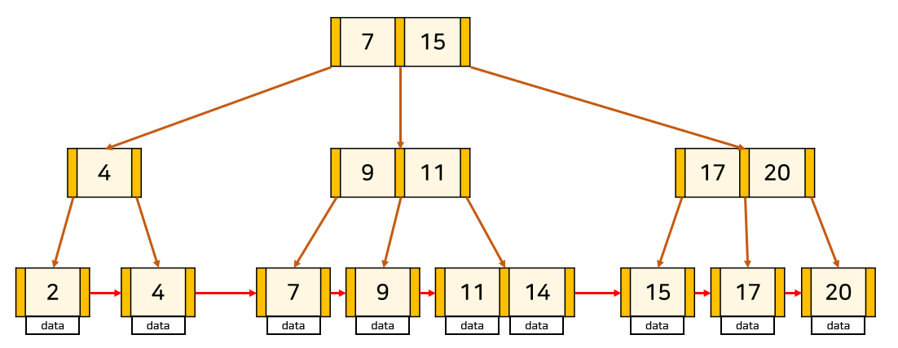

### Index란?
- 데이터베이스 테이블에 대한 검색 성능의 속도를 높여주는 자료구조이다.
- 데이터베이스에서도 테이블의 모든 데이터를 검색하면 시간이 오래 걸리기 때문에 데이터와 데이터의 위치를 포함한 자료구조를 생성하여 빠르게 조회할 수 있도록 한다.

### Index의 장단점
- 장점
    1. 데이터가 정렬되어 있기 때문에 테이블에서 검색과 정렬 속도를 향상시킨다.
        - 조건 검색 Where절의 효율성: 보통 Where절의 사용할 때 특정 조건에 맞는 데이터를 찾기 위해 데이터를 처음부터 끝까지 다 비교해야 하는데, 인덱스를 통해 데이터가 정렬되어 있으면 빠르게 찾아낼 수 있다.

        - 정렬 Order by 정의 효율성: 인덱스를 사용하면 Order by에 의한 Sort과정을 피할 수 있다. 본래 Order by는 괴장히 부하가 많이 걸리는 작업이기 때문에 인덱스를 통해 이미 정렬되어 있으면 부하가 걸리지 않을 수 있다.

        - MIN, MAX의 효율적인 처리가 가능: 이것또한 인덱스를 통해 데이터가 정렬되어 있기 때문에 처음부터 끝까지 뒤져서 찾는 것이 아닌 인덱스로 정렬된 데이터에서 MIN, MAX를 효율적으로 추출할 수 있다.

    2. 시스템의 전반적인 부하를 줄일 수 있다.
        - 인덱스를 사용하면 Full Scan을 하지 않아도 되기 때문에 전반적인 부하를 줄일 수 있다.

- 단점
    1. 정렬된 상태를 계속 유지시켜야 한다.  
        - 인덱스는 정렬된 상태를 유지하여 데이터를 빠르게 조회할 수 있도록 해야 한다. 그렇기 떄문에 데이터가 삽입 수정 삭제가 발생하면 인덱스에도 반영하여 정렬된 상태를 지속적으로 유지 시켜줘야 한다.
    
    2. 인덱스를 관리하기 위해 DB의 약 10%에 해당하는 저장공간이 필요하다.
        - 인덱스를 관리하기 위해서는 데이터베이스의 약 10%에 해당하는 저장공간이 추가로 필요하다. 때문에 너무 많이 인덱스를 생성하면 하나의 쿼리문을 빠르게 만들 수 있지만 대신에 전체적인 데이터베이스의 성능 부하를 추래한다. 때문에 무조건적인 인덱스 생성보다 SQL문을 효율적으로 짜고, 인덱스 생성은 마지막 수단으로 사용해야한다.

    3. 규모가 작은 테이블에서는 효과가 없다.
        - 검색을 위주로 하는 테이블에 인덱스를 생성하는 것이 좋지만 무조건 인덱스가 검색에 좋은 것은 아니다. 예를 들어, 1개의 데이터가 있는 테이블과 100만개의 데이터가 들어 있는 테이블이 있다고 하자. 100만 개의 데이터가 들어있는 테이블이라면 풀 스캔보다는 인덱스 스캔이 유리하겠지만, 1개의 데이터가 들어있는 테이블은 익덱스 스캔보다 풀 스캔이 더 빠르다.

### Index를 사용하면 좋은 곳
1. 규모가 작지 않은 테이블
2. INSERT, UPDATE, DELETE가 자주 발생하지 않는 컬럼
3. JOIN이나 WHERE 또는 ORDER BY에 자주 사용되는 컬럼
4. 데이터의 중복도가 낮은 컬럼
    - 인덱스는 내부적으로 Key,Value의 트리 형태로 데이터를 저장하는데, 데이터(Key)가 중복되어 여러개 존재하면 검색되는 대상이 증가하기 때문에 중복도가 낮은 컬럼에 사용한다.

### Index 자료구조
1. Hash Table
    - 해시 테이블은 (Key, Value)로 데이터를 저장하는 자료구조 중 하나로 빠른 데이터 검색이 필요할 때 유용하다. 해시 테이블은 Key값을 이용해 고유한 index를 생성하여 그 index에 저장된 값을 꺼내오는 구조이다.
    
    - 해시 테이블 기반의 DB 인덱스는 (데이터=컬럼의 값, 데이터의 위치)를 (Key, Value)로 사용하여 컬럼의 값으로 생성된 해시를 통해 인덱스를 구현하였다. 해시 테이블의 시간복잡도는 O(1)이며 매우 빠른 검색을 지원한다.
   
    - 하지만 DB 인덱스에서 해시 테이블이 사용되는 경우는 제한적인데, 그러한 이유는 해시가 등호(=) 연산에만 특화되었기 때문이다. 해시 함수는 값이 1이라도 달라지면 완전히 다른 해시 값을 생성하는데, 이러한 특성에 의해 부등호 연산(>, <)이 자주 사용되는 데이터베이스 검색을 위해서는 해시 테이블이 적합하지 않다.즉, 예를 들면 "나는"으로 시작하는 모든 데이터를 검색하기 위한 쿼리문은 인덱스의 혜택을 전혀 받지 못하게 된다. 이러한 이유로 데이터베이스의 인덱스에서는 B+Tree가 일반적으로 사용된다.

    

2. B+Tree
    - B+Tree는 DB의 인덱스를 위해 자식 노드가 2개 이상인 B-Tree를 개선시킨 자료구조이다. B+Tree는 모든 노드에 데이터(Value)를 저장했던 BTree와 다른 특성을 가지고 있다.
    
    - 리프노드(데이터노드)만 인덱스와 함께 데이터(Value)를 가지고 있고, 나머지 노드(인덱스노드)들은 데이터를 위한 인덱스(Key)만을 갖는다.
    
    - 리프노드들은 LinkedList로 연결되어 있다.
    
    - 데이터 노드 크기는 인덱스 노드의 크기와 같지 않아도 된다.
    
    - 데이터베이스의 인덱스 컬럼은 부등호를 이용한 순차 검색 연산이 자주 발생될 수 있다. 이러한 이유로 BTree의 리프노드들을 LinkedList로 연결하여 순차검색을 용이하게 하는 등 BTree를 인덱스에 맞게 최적화하였다. 

    